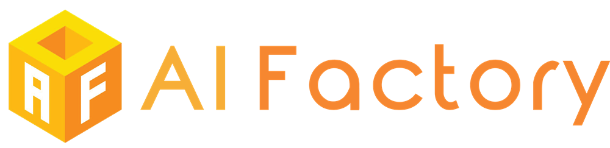

# AI인공지능 / 데이터 경진대회 목록

# 현재 진행중인 대회

* **[Indoor Location & Navigation](https://www.kaggle.com/c/indoor-location-navigation)**

    * 분류: 
    * 주최: Microsoft Research
    * 주관: 
    * 일시: 1월 28일 ~ 5월 17일 23:59 UTC
    * 상금: $10,000
    * 요약: Identify the position of a smartphone in a shopping mall

* **[한국 부동산 데이터 시각화 경진대회](https://dacon.io/competitions/official/235724)**

    * 분류: `Visualization`
    * 주최/주관: 
    * 일시: 4월 21일 ~ 5월 26일 17:59
    * 상금: 100만원
    * 요약: 부동신 정보 시각화. 유저 평가.
    
* **[BirdCLEF 2021 - Birdcall Identification](https://www.kaggle.com/c/birdclef-2021)**

    * 분류: `Audio Classification`, `Segmentation`
    * 주최: Cornell Lab of Ornithology
    * 주관: 
    * 일시: 4월 1일 ~ 5월 31일 23:59 UTC
    * 상금: $5,000
    * 요약: 새의 울음소리를 통해 어떤 새인지 예측한다. Train dataset은 classification이지만 inference는 time series segmentation으로 진행된다는 특징이 있다.

* **[2021년도 인공지능 온라인 경진대회](https://www.aiconnect.kr)**

    * 분류: 
    * 주최: 과학기술정보통신부
    * 주관: NIPA(정보통신산업진흥원)
    * 일시: 사전접수: 5월 17일 ~ 5월 31일 | 본접수: 6월 7일 ~ 6월 11일 | 본선일정 6월 21일 ~ 7월 2일
    * 상금: 
    * 요약: 

* **[Bristol-Myers Squibb – Molecular Translation](https://www.kaggle.com/c/bms-molecular-translation)**

    * 분류: `Multi-Modal`
    * 주최: Bristol-Mysters Squibb
    * 주관: 
    * 일시: 3월 2일 ~ 6월 2일 23:59 UTC
    * 상금: $50,000
    * 요약: 화학 구조 이미지를 InChI 텍스트로 번역한다.

* **[동서발전 태양광 발전량 예측 AI 경진대회](https://dacon.io/competitions/official/235720)**

    * 분류: `Time Series`, `Prediction`
    * 주최: 한국동서발전(주)
    * 주관: 
    * 일시: 4월 7일 ~ 6월 8일 18:00
    * 상금: 개인 1~3위 (500, 300, 200)만원 | 스타트업 1~3위 (300, 200, 100)만원
    * 요약: 미래의 태양광 발전량을 예측한다.

* **[포스코ICT 2021 AI 챌린지 '청소년 AI 창의경진대회](https://aichallenge.poscoict.com/)**

    * 주최: posco, 포스코ICT
    * 주관: AIIA(지능정보산업협회)
    * 후원: 과학기술정보통신부
    * 접수기간: 4월 22일 ~ 6월 14일
    * 총상금: 1700만원
    * **참가대상: 중학생, 고등학생**

* **[전력사용량 예측 AI 경진대회](https://dacon.io/competitions/official/235736)**

    * 분류: `Time Series`, `Prediction`
    * 주최: 한국에너지공단
    * 주관: 
    * 일시: 5월 10일 ~ 6월 25일 17:59
    * 상금: Modeling분야 1500만원 | Analytics분야 300만원
    * 요약: 미래의 전력사용량을 예측한다.

* **[북극 해빙예측 AI 경진대회](https://dacon.io/competitions/official/235731)**

    * 분류: `Computer Vision`, `Time Series`, `Prediction`
    * 주최: 극지연구소(KOPRI)
    * 주관: 
    * 일시: 5월 10일 ~ 6월 30일 17:59
    * 상금: 600만원
    * 요약: 미래에 해빙의 분포(이미지)를 예측한다.

* **[하천 하구의 수온·염분 예측을 위한 알고리즘 개발](http://aifactory.space/task/detail.do?taskId=T001952)**

    * 분류: 
    * 주최: 한국수자원공사, ㈜휴먼플래닛
    * 주관: AIFactory 
    * 일시: 6월 1일 ~ 6월 30일
    * 상금: 미정
    * 요약: 

* **[SETI Breakthrough Listen - E.T. Signal Search](https://www.kaggle.com/c/seti-breakthrough-listen)**

    * 분류: 
    * 주최: Berkeley SETI Research Center
    * 주관: 
    * 일시: 5월 10일 ~ 7월 28일 23:59 UTC
    * 상금: $15,000
    * 요약: 

* **[CommonLit Readability Prize](https://www.kaggle.com/c/commonlitreadabilityprize)**

    * 분류: `NLP`, `Regression`
    * 주최: CommonLit
    * 주관: 
    * 일시: 5월 3일 ~ 8월 2일 23:59 UTC
    * 상금: $60,000
    * 요약: 텍스트의 난이도 점수를 예측한다.
    
* **[Google Smartphone Decimeter Challenge](https://www.kaggle.com/c/google-smartphone-decimeter-challenge)**

    * 분류: 
    * 주최: Google
    * 주관: 
    * 일시: 5월 12일 ~ 8월 4일 23:59 UTC
    * 상금: $10,000
    * 요약: Improve high precision GNSS positioning and navigation accuracy on smartphones

# 지난 대회 목록

* **[Jane Street Market Prediction](https://www.kaggle.com/c/jane-street-market-prediction)**

    * 분류: 
    * 주최: Jane Street Group
    * 주관: 
    * 일시: 참가기간 2월 15일 ~ 2월 22일 23:59 UTC | 평가기간 ~ 8월 23일 23:59 UTC
    * 상금: $100,000

# Contribution

대회는 마감 일시를 기준으로 정렬하며, 정확하지 않은 정보가 있을 수 있습니다.
